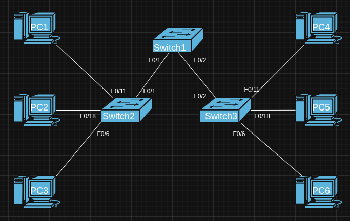

# Goals

- The trainee will understand the concepts of subnetting and apply them to design and implement IP addressing schemes in a Layer 2 network.
- The trainee will understand the concept and operation of VLANs.
- The trainee will be able to configure VLANs and verify their functionality.
- The trainee will understand the operation of Spanning Tree Protocol.

## Tasks

- **Subnetting**
  - Explain what is subnetting, and why is it needed.
  - Explain the limitations of classful addressing and how CIDR solved them.
  - Explain the difference between FLSM and VLSM. Why is VLSM usually preferred in modern networks? Provide an example.

  ### LAB

  - Using Packet Tracer:
    - You are a network engineer at a new company! The company has 3 departments: Core, BD, Platforms.
    - Each department has 2 PCs. You are given a 192.168.10.0/24 network.
        Subnet the 192.168.10.0/24 network into at least 3 subnets, one for each department.
    - Assign IP addresses to all PCs, ensuring:
            1. First usable IP is assigned to the first PC in each department.
            2. Use three switches (one per department) and one router.
            3. Configure router interfaces with the correct subnet IPs (Router-on-a-Stick if you want extra difficulty!).
    - Test connectivity:
      - PCs in the same department must ping each other.
      - PCs across departments must **NOT** ping each other.

- **Vlans**
  - What are VLANs and why are they used?  
  - What is the difference between trunk and access ports? How does VLAN tagging work in each?  
  - Explain the difference between the native VLAN and the default VLAN.

  ### LAB

  - Using Packet Tracer create the following lab using the addressing and port tables below:
    

  #### Addressing Table

    | Hostname | Interface | IP Address     | Subnet Mask     | Default Gateway |
    |----------|-----------|----------------|------------------|----------------|
    | S1  | VLAN 99| 192.168.99.11| 255.255.255.0| N/A         |
    | S2  | VLAN 99| 192.168.99.12| 255.255.255.0| N/A         |
    | S3  | VLAN 99| 192.168.99.13| 255.255.255.0| N/A         |
    | PC1 | NIC    | 192.168.10.21| 255.255.255.0| 192.168.10.1|
    | PC2 | NIC    | 192.168.20.22| 255.255.255.0| 192.168.20.1|
    | PC3 | NIC    | 192.168.30.23| 255.255.255.0| 192.168.30.1|
    | PC4 | NIC    | 192.168.10.24| 255.255.255.0| 192.168.10.1|
    | PC5 | NIC    | 192.168.20.25| 255.255.255.0| 192.168.20.1|
    | PC6 | NIC    | 192.168.30.26| 255.255.255.0| 192.168.30.1|

  ##### Initial Port Assignment

    | Ports         | Assignment                     | Network            |
    |---------------|--------------------------------|--------------------|
    | Fa0/1 – 0/5  | 802.1q Trunks (Native VLAN 99)| 192.168.99.0 /24|
    | Fa0/6 – 0/10 | VLAN 30 – Guest               | 192.168.30.0 /24|
    | Fa0/11 – 0/17| VLAN 10 – Faculty/Staff       | 192.168.10.0 /24|
    | Fa0/18 – 0/24| VLAN 20 – Students            | 192.168.20.0 /24|

- **STP**
  - Explain what is broadcast storm. How does it happen?
  - Watch [Introduction to Spanning-Tree](https://www.youtube.com/watch?v=ISNTZgiywO8)
  - Watch [How Spanning-Tree Works](https://www.youtube.com/watch?v=5xMcvfn61-E)
  - How does STP create a loop-free topology?
  - What is a root bridge in STP, and how is it chosen?
  - Detail the different STP port states
  - Describe the process of root bridge election and best path selection.
  - Explain the purpose and operation of advanced STP features like PortFast, BPDU Guard, and BPDU Filter.
  - Explain the concept of PVST+ and how it differs from traditional STP, including the role of VLAN IDs in the Bridge ID calculation.
  - What are the port states in RSTP? What are the differences between those states to the regular STP's states?
