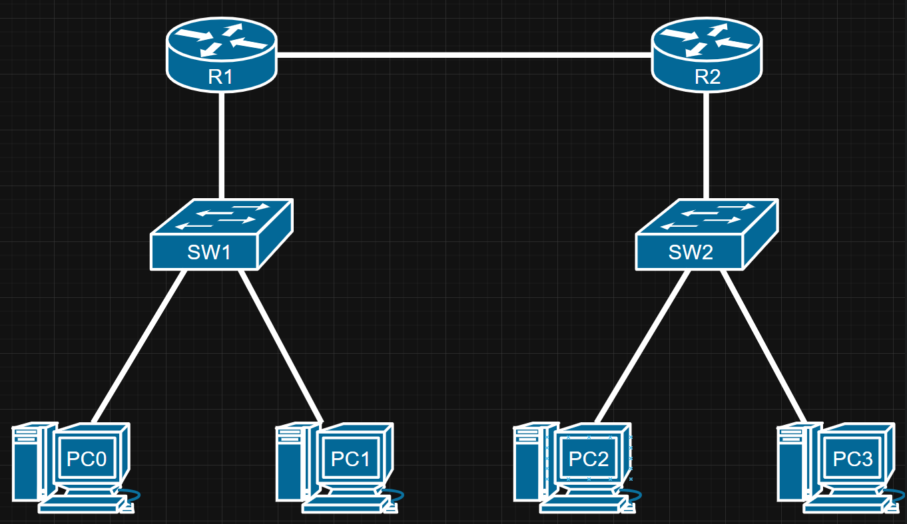

### Goals
- The trainee will understand core IP concepts, including addressing and packet structure.  
- The trainee will understand ARP and how devices resolve IP addresses.
- The trainee will understand how OSPF works and how it builds routing tables.  
- The trainee will be able to explain key OSPF mechanisms such as neighbor discovery, LSDB synchronization, and path selection.
- The trainee will be familiar with ACL and it types

### Tasks
- **IP**
    - Describe the IPv4 packet header and its main fields.
    - Explain the flow of the ARP protocol.
    - What is ARP spoofing?
    - Explain what a gratuitous ARP is, how it prevents flooding, and the concept of a "silent host".
    - What is the purpose of the loopback IP address (127.0.0.1)? How is it useful during troubleshooting?
    - What is the meaning of a static route with 0.0.0.0/0 as the destination network?
    - How multiple static routes to the same destination are handled by a router?

    #### LAB
    - Using Packet Tracer:
        - You are tasked to build a basic network connecting two remote offices through routers.
        - You must configure default gateways for all PCs and set up static routes between routers to ensure full communication across the network.
        
        
    ##### Addressing Table
    | Device |  Interface  |  IP Address  | Subnet Mask
    |  ----  | ----------- | ------------ | ---------
    |  R1    | G0/0        | 192.168.1.1  | 255.255.255.0
    |  R1    | Serial0/0/0 | 10.0.0.1     | 255.255.255.252
    |  R2    | Serial0/0/0 | 10.0.0.2     | 255.255.255.252
    |  R2    | G0/0        | 192.168.2.1  | 255.255.255.0
    |  PC0   | —           | 192.168.1.10 | 255.255.255.0
    |  PC1   | —           | 192.168.1.11 | 255.255.255.0
    |  PC2   | —           | 192.168.2.10 | 255.255.255.0
    |  PC3   | —           | 192.168.2.11 | 255.255.255.0

    - Set Default Gateways on PCs:
        - PC0 and PC1 ➔ Default Gateway: 192.168.1.1
        - PC2 and PC3 ➔ Default Gateway: 192.168.2.1

    - Configure Static Routes on Routers:
        - On R1, add a static route to the 192.168.2.0/24 network via 10.0.0.2.
        - On R2, add a static route to the 192.168.1.0/24 network via 10.0.0.1.

    - Verify Connectivity:
        1. Ping from PC0 to PC2 and PC3.
        2. Ping from PC1 to PC2 and PC3.
        3. PCs in the same site should also ping each other.

- **OSPF**
    - Explain the role of the Hello protocol in OSPF and the information exchanged in Hello messages.
    - How do OSPF routers build a neighbor table, and what fields are typically included?
    - What conditions must be met for two OSPF routers to become neighbors?
    - Describe the process of building the Link State Database (LSDB) in OSPF, including the exchange of Link State Advertisements (LSAs) and Link State Updates (LSUs).
    - What is the primary metric OSPF uses to determine the best path, and how can this be manipulated to influence path selection?
    - Explain the different types of OSPF messages and their purpose in establishing and maintaining OSPF adjacencies and synchronizing LSDBs.
    - Describe the function of LSA Types 1, 2, and 3, and the information each carries.
    - Why are passive interfaces used in OSPF?
    - Explain the issue that arises when using OSPF in broadcast networks and how the introduction of Designated Router (DR) and Backup Designated Router (BDR) helps address this problem.
    - Describe the different OSPF neighbor states and what happens in each state.
    - Explain the concept of multi-area OSPF and the roles of Area Border Routers (ABRs), Backbone Routers, and Autonomous System Border Routers (ASBRs).
    - An OSPF adjacency is stuck in the EXSTART or EXCHANGE state. While basic connectivity and other OSPF parameters appear correct, what issue could be causing this specific problem state.

- **ACL**
    - What is an Access Control List (ACL) in networking, and what is its primary purpose?
    - Explain the different types of ACLs.
    - When should we use standard or extended ACL?
    - How do you apply an ACL to an interface on a router or switch?
    - How can you log matches to ACL rules for auditing or troubleshooting purposes?
    - Explain the parts of a line in an ACL.
    - What is the Remark part in the ACL?

    #### LAB
    - Configure interfaces and assign IP addresses. (Verify all PCs can ping each other.)
    - Create a standard ACL to block PC1 (192.168.10.10) from accessing any device in VLAN 20 (192.168.20.0/24). (Apply the ACL in the correct direction and interface.)
    - Create an extended ACL to allow only HTTP (port 80) traffic from PC2 (192.168.10.20) to PC3 (192.168.20.10), but deny all other traffic between these two hosts.
    - Verify the following:
        1. PC1 cannot ping or access any device in VLAN 20.
        2. PC2 can access HTTP on PC3, but cannot ping or use other protocols.
        3. All other traffic is unaffected.
    
    ##### Addressing Table

    | Hostname | Interface | IP Address     |
    |----------|-----------|----------------|
    | R1       | G0/0      | 192.168.10.1/24|
    | R1       | G0/1      | 192.168.20.1/24|
    | S1       | Vlan10    | 192.168.10.2/24|
    | S2       | Vlan20    | 192.168.20.2/24|
    | PC1      | NIC       | 192.168.10.10/24 (Vlan 10)|
    | PC2      | NIC       | 192.168.10.20/24 (Vlan 10)|
    | PC3      | NIC       | 192.168.20.10/24 (Vlan 20)|
    | PC4      | NIC       | 192.168.20.20/24 (Vlan 20)|