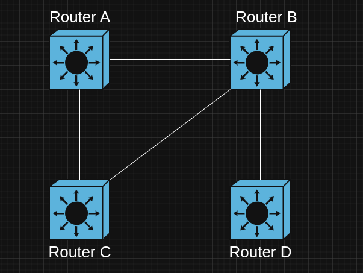

### Goals

- The trainee will understand the BGP protocol.
- The trainee will be familiar with BGP neighbor states.
- The trainee will be familiar with BGP attributes and path selection.
- The trainee will know how to configure BGP on NX-OS switches

### Tasks

- Watch this course about BGP: [BGP and Path Selection](https://www.pluralsight.com/courses/cisco-enterprise-networks-bgp-path-control)
- In BGP, what is an Autonomous System (AS), what routing protocols can it use internally, what are the private ASN ranges, and what are the consequences of using an unauthorized public ASN?
- Explain the purpose of BGP and how it differs from OSPF.
- What are the types of BGP messages and what is the purpose of each?
- What are the BGP neighbor states and what happens in each state?
- Which BGP path attribute is used for loop prevention, and how does it work?
- What is the difference between eBGP and iBGP?
- What is the iBGP full mesh rule, and why does it exist?
- What is a route reflector, and how does it help scale BGP?
- Describe the four categories of BGP path attributes.
- Describe in order the BGP best-path selection process, and explain in detail what happens at each step.
- What are BGP communities, and how are they used?
- What are BGP timers, and what roles do they play in maintaining BGP sessions?

    #### LAB
    Using EVE-NG, configure each router in the topology with a separate autonomous system. Implement BGP routing between them, applying BGP communities and local preference settings to influence path selection and traffic flow. The list below describes the path selection and the backups.

    

    Between Router A and Router B:

    1. Direct
    2. Through C

    Between Router A and Router C:

    1. Direct
    2. Through B

    Between Router A and Router D:

    1. Through B
    2. Through C

    Between Router B and Router C:

    1. Direct
    2. Through A
    3. Through D

    Between Router B and Router D:

    1. Direct
    2. Through C
    3. Through A

    Between Router C and Router D:

    1. Through B
    2. Direct
    3. Through A
