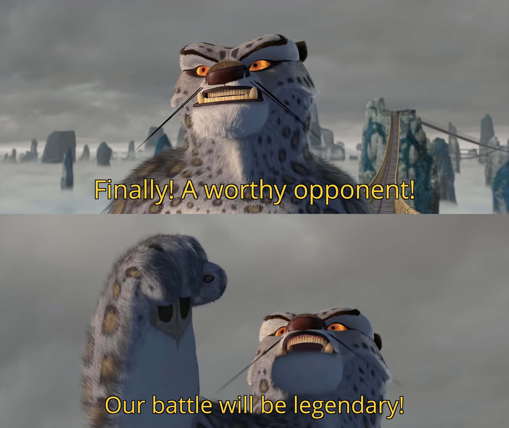

### Goals
- The trainee will know how to configure connections of servers from zero.

### Tasks
- Get the connection table for the two servers in the pre-prod environment from your trainer. Configure both servers to be in the same VLAN. You must create all required ACI objects (e.g., VLAN groups, domains, etc.) yourself without using any pre-existing ones.
- Verify that the two servers can successfully communicate with each other.

