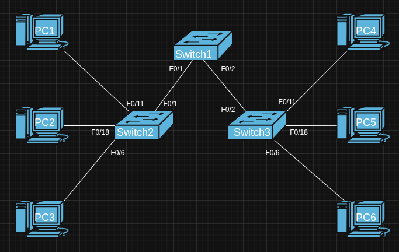

# Goals

- The trainee understand the concept of vlans.
- The trainee will understand how vlans work.
- The trainee will know how to configure vlans.

## Tasks

- What are vlans?
- What are the benefits of using vlans?
- How do vlans work? Explain in detail.
- What is the difference between trunk and access ports? How vlan tagging works in each one?
- There is more than one type of vlan, two of them are native vlan and default vlan. Explain each one and what is the difference between them.
- Configure the following lab:

### Addressing Table

| Hostname | Interface | IP Address     | Subnet Mask     | Default Gateway |
|----------|-----------|----------------|------------------|------------------|
| S1       | VLAN 99   | 192.168.99.11   | 255.255.255.0    | N/A               |
| S2       | VLAN 99   | 192.168.99.12   | 255.255.255.0    | N/A               |
| S3       | VLAN 99   | 192.168.99.13   | 255.255.255.0    | N/A               |
| PC1      | NIC       | 192.168.10.21   | 255.255.255.0    | 192.168.10.1      |
| PC2      | NIC       | 192.168.20.22   | 255.255.255.0    | 192.168.20.1      |
| PC3      | NIC       | 192.168.30.23   | 255.255.255.0    | 192.168.30.1      |
| PC4      | NIC       | 192.168.10.24   | 255.255.255.0    | 192.168.10.1      |
| PC5      | NIC       | 192.168.20.25   | 255.255.255.0    | 192.168.20.1      |
| PC6      | NIC       | 192.168.30.26   | 255.255.255.0    | 192.168.30.1      |

### Initial Port Assignment

| Ports         | Assignment                     | Network            |
|---------------|--------------------------------|---------------------|
| Fa0/1 – 0/5   | 802.1q Trunks (Native VLAN 99) | 192.168.99.0 /24     |
| Fa0/6 – 0/10  | VLAN 30 – Guest                | 192.168.30.0 /24     |
| Fa0/11 – 0/17 | VLAN 10 – Faculty/Staff        | 192.168.10.0 /24     |
| Fa0/18 – 0/24 | VLAN 20 – Students             | 192.168.20.0 /24     |
