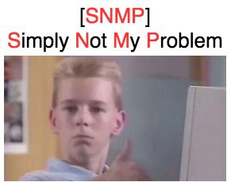

# Goals

- The trainee will understand SNMP protocol
- The trainee will be familiar with the different SNMP versions
- The trainee will be familiar with the different SNMP operations

## Tasks

- What is SNMP?
- What are SNMP agent and network management system (NMS)?
- What is a MIB in SNMP?
- What are the objects in a MIB? Why their ID means?
- What are the types of OIDs
- What are the six main SNMP protocol operations, and which side — the manager or the agent — initiates each one?
- What is the SNMP walk operation, and when is it used?
- What are the two first versions of SNMP, and what are their differences?
- What is the role of an SNMP community string? What is the problem of using it?
- What is SNMPv3, and how does it improve upon previous versions of the protocol?
- What is the User-Based Security Model (USM) in SNMPv3, what it provides?
- What are some challenges in implementing SNMPv3?

