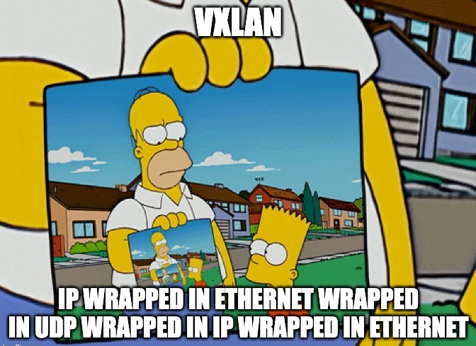

# VXLAN Basics – Trainee Guide

### Goals

- Understand the purpose and advantages of VXLAN over traditional VLANs.
- Be familiar with VXLAN encapsulation and header structure.
- Understand how VXLAN is used in spine-leaf architectures.
- Learn the difference between flood-and-learn and EVPN-based MAC address learning.

---

### Notes

You are encouraged to explore multiple resources, not just the videos listed below. The videos are provided to help you get started, but reading RFCs, vendor documentation (like Cisco, Juniper, or Arista), or technical blog posts will strengthen your understanding.

#### Recommended Videos

1. [VXLAN | How VXLAN Works](https://www.youtube.com/watch?v=YNqKDI_bnPM)
2. [VXLAN | Header Format and Encapsulation](https://www.youtube.com/watch?v=jjr8aIIRkYc)
3. [VXLAN | Spine Leaf Topology](https://www.youtube.com/watch?v=x1F-RCW9fqo)
4. [VXLAN | Address Learning](https://www.youtube.com/watch?v=Do6G9w_DjJ4)

---

### Tasks

#### How VXLAN Works

- What problem does VXLAN solve in traditional VLAN-based networks, especially in large-scale data centers?
- How does VXLAN use MAC-in-UDP encapsulation to extend Layer 2 networks over Layer 3?

#### VXLAN Header Format and Encapsulation

- What are the key components of the VXLAN header, and what is the significance of the VNI (VXLAN Network Identifier)?
- How does VXLAN encapsulation change the original Ethernet frame, and what layers are added during encapsulation?

#### Spine-Leaf Topology in VXLAN

- Why is the spine-leaf architecture commonly used in VXLAN deployments, and how does it enhance scalability?
- How does the leaf switch act as a VTEP (VXLAN Tunnel Endpoint), and what is its role in encapsulation and decapsulation?

#### Address Learning in VXLAN

- What are the two methods of MAC address learning in VXLAN — and how do they differ?
- How does control-plane learning (e.g., with EVPN) improve over flood-and-learn in VXLAN deployments?

---

